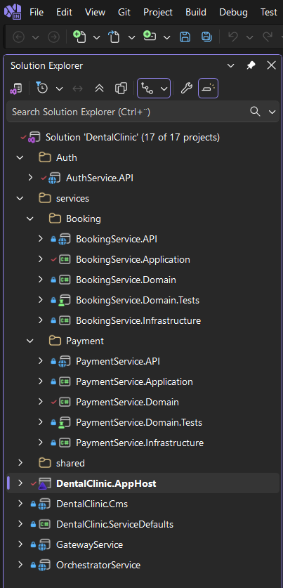
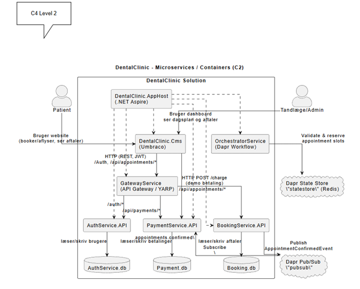
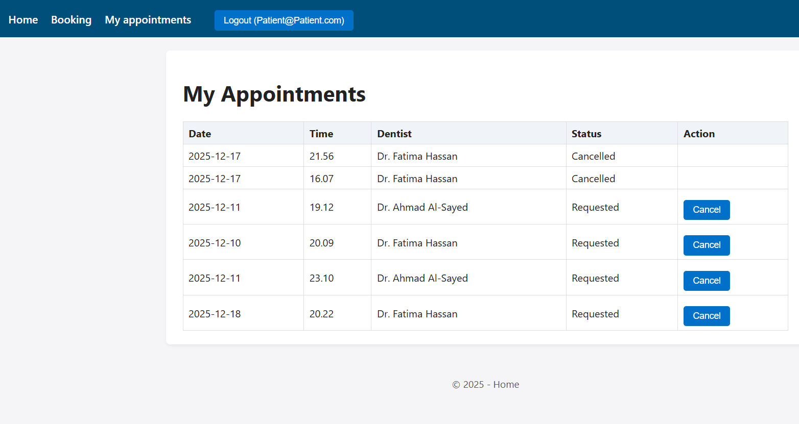
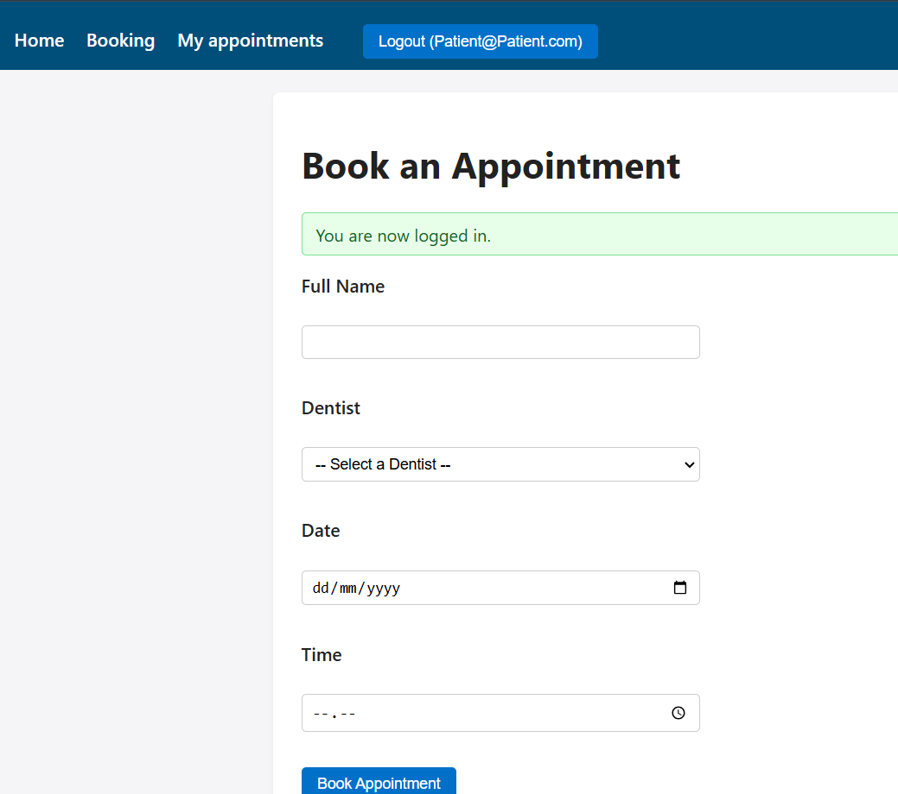
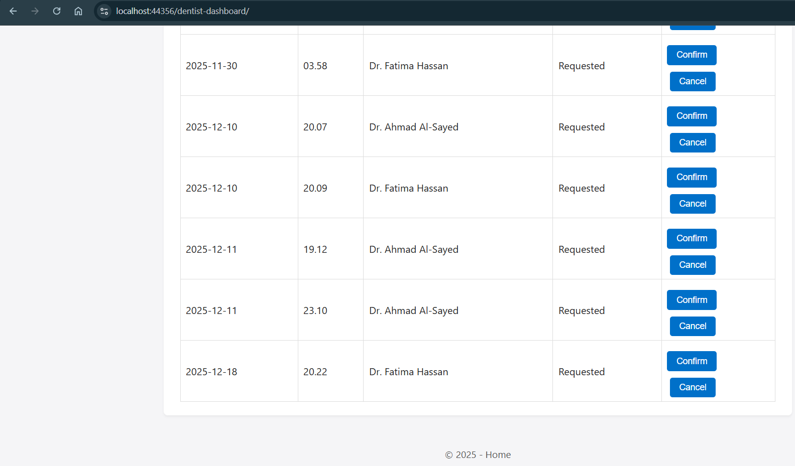
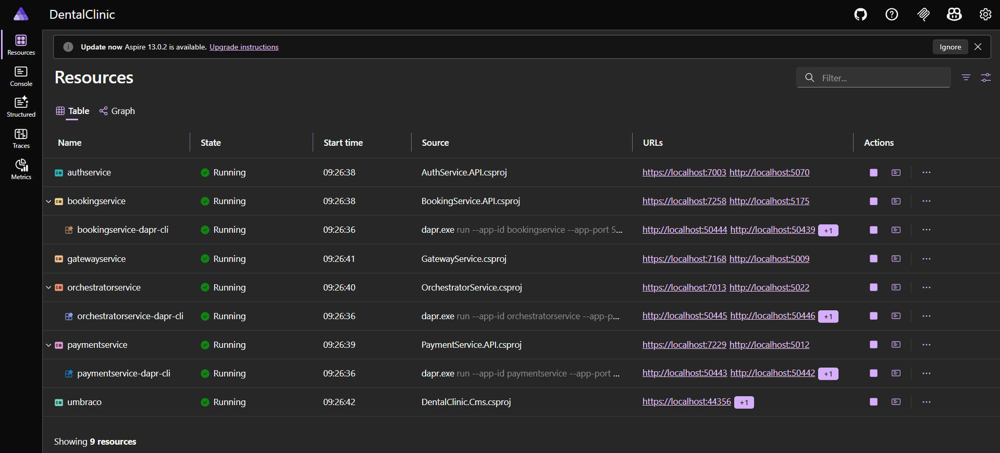
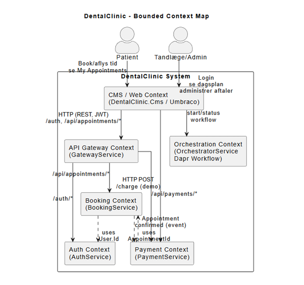
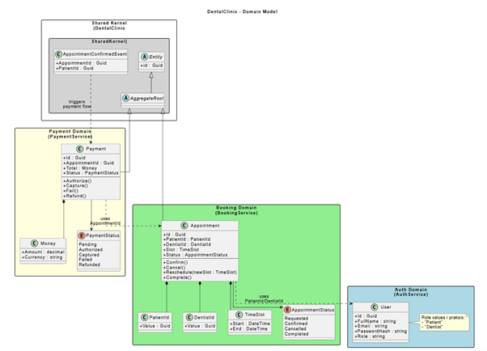

# Dental Clinic System

A microservices-based dental clinic management system built with .NET 9, featuring appointment booking, payment processing, and CMS capabilities.

## 📸 Screenshots

> **Note**: All screenshots and diagrams are organized in the [`docs/`](docs/) folder.

### System Architecture

<div align="center">


*Microservices architecture with API Gateway, DDD services, and Dapr integration*

</div>

### Microservices Architecture (C4 Model)

<div align="center">


*C4 Model Level 2 - Container diagram showing microservices and their dependencies*

</div>

### Application Screenshots

<div align="center">

| Patient Dashboard | Booking Form | Dentist Dashboard |
|-------------------|--------------|-------------------|
|  |  |  |

</div>

### .NET Aspire Dashboard

<div align="center">


*Real-time monitoring and distributed tracing with .NET Aspire*

</div>

### Context Map & Domain Model

<div align="center">

| Context Map | Domain Model |
|-------------|--------------|
|  |  |

</div>

📚 **[View More Documentation](docs/)** | 📸 **[Image Capture Guide](docs/IMAGE_CAPTURE_GUIDE.md)** | 📊 **[Diagrams Source](docs/DIAGRAMS_SOURCE.md)**

## Architecture

This solution follows Domain-Driven Design (DDD) principles with a microservices architecture:

- **AuthService.API**: Authentication and authorization service
- **BookingService**: Appointment booking and management (DDD structure)
- **PaymentService**: Payment processing (DDD structure)
- **GatewayService**: API Gateway with JWT authentication and YARP reverse proxy
- **OrchestratorService**: Workflow orchestration
- **DentalClinic.Cms**: Umbraco CMS for content management
- **DentalClinic.AppHost**: .NET Aspire AppHost for orchestration

## Prerequisites

- .NET 9 SDK
- Docker Desktop (for Dapr and dependencies)
- Dapr CLI

## Configuration

⚠️ **Important**: Read the [Configuration Security Guide](docs/CONFIGURATION_SECURITY.md) before deploying to production.

### JWT Secret Key

**IMPORTANT**: Before deploying to production, you must set a strong JWT secret key.

The default configuration uses `"CHANGE_ME_IN_PRODUCTION"` as a placeholder.

#### Option 1: User Secrets (Recommended for Development)

```bash
# For AuthService
cd AuthService.API
dotnet user-secrets set "Jwt:Key" "your-strong-secret-key-here"

# For GatewayService
cd ../GatewayService
dotnet user-secrets set "Jwt:Key" "your-strong-secret-key-here"
```

#### Option 2: Environment Variables (Recommended for Production)

```bash
export Jwt__Key="your-strong-secret-key-here"
```

Or in Docker/Kubernetes:
```yaml
env:
  - name: Jwt__Key
    valueFrom:
      secretKeyRef:
        name: jwt-secret
        key: key
```

### Database

The services use SQLite by default for development:
- `AuthService.db` - Authentication service database
- `BookingService.db` - Booking service database
- `PaymentService.db` - Payment service database
- `Umbraco.sqlite.db` - CMS database

**Note**: These database files are **not** included in the repository (excluded via `.gitignore`). They will be created automatically when you first run the application. Each service uses Entity Framework Core migrations to create its schema.

## Running the Application

### Using .NET Aspire (Recommended)

```bash
dotnet run --project DentalClinic.AppHost
```

### Using Dapr (Manual)

Start each service with Dapr:

```bash
# Terminal 1 - AuthService
dapr run --app-id authservice --app-port 5070 -- dotnet run --project AuthService.API

# Terminal 2 - BookingService
dapr run --app-id bookingservice --app-port 5071 --resources-path ./components -- dotnet run --project Booking/BookingService.API

# Terminal 3 - PaymentService
dapr run --app-id paymentservice --app-port 5072 --resources-path ./components -- dotnet run --project Payment/PaymentService.API

# Terminal 4 - GatewayService
dapr run --app-id gatewayservice --app-port 5073 -- dotnet run --project GatewayService

# Terminal 5 - Umbraco CMS
dotnet run --project DentalClinic.Cms
```

## Testing

The solution includes unit tests for domain logic:

```bash
# Run all tests
dotnet test

# Run specific test project
dotnet test services/Booking/BookingService.Domain.Tests
dotnet test services/Payment/PaymentService.Domain.Tests
```

## API Endpoints

### AuthService (via Gateway)
- `POST /auth/register` - Register new user
- `POST /auth/login` - Login and get JWT token

### BookingService (via Gateway)
- `GET /api/appointments/mine` - Get current user's appointments
- `GET /api/appointments/dentist` - Get dentist's appointments (Dentist role)
- `POST /api/appointments` - Create new appointment
- `POST /api/appointments/cancel` - Cancel appointment

### PaymentService (via Gateway)
- `GET /api/payments/{id}` - Get payment details

## Project Structure

```
DentalClinic/
├── AuthService.API/                    # Authentication service
├── Booking/                            # Booking bounded context
│   ├── BookingService.API/             # API layer
│   ├── BookingService.Application/     # Application services
│   ├── BookingService.Domain/          # Domain entities and logic
│   └── BookingService.Infrastructure/  # Data access
├── Payment/                            # Payment bounded context
│   ├── PaymentService.API/
│   ├── PaymentService.Application/
│   ├── PaymentService.Domain/
│   └── PaymentService.Infrastructure/
├── services/                           # Test projects
│   ├── Booking/BookingService.Domain.Tests/
│   └── Payment/PaymentService.Domain.Tests/
├── GatewayService/                     # API Gateway with YARP
├── OrchestratorService/                # Workflow orchestration
├── DentalClinic.Cms/                   # Umbraco CMS
├── DentalClinic.AppHost/               # .NET Aspire orchestration
├── DentalClinic.ServiceDefaults/       # Shared service extensions
└── shared/DentalClinic.SharedKernel/   # Shared domain events
```

## Technologies Used

- .NET 9
- ASP.NET Core Web API
- Entity Framework Core (SQLite)
- Umbraco CMS
- Dapr (for pub/sub and service invocation)
- YARP (Yet Another Reverse Proxy)
- JWT Bearer Authentication
- .NET Aspire
- xUnit (for testing)

## Security Notes

- **JWT Authentication**: Tokens are validated at the API Gateway level
- **User Context**: Individual services receive user context via `X-UserId` header
- **Secrets Management**: JWT keys and sensitive configuration should be stored in:
  - Development: User Secrets (`dotnet user-secrets`)
  - Production: Environment variables or secure configuration providers (Azure Key Vault, AWS Secrets Manager)
- **Database Security**: 
  - Database files (`*.db`, `*.db-shm`, `*.db-wal`) are excluded from version control
  - No production data should be committed to the repository
  - Use separate databases for development, staging, and production environments

## License

[Your License Here]
