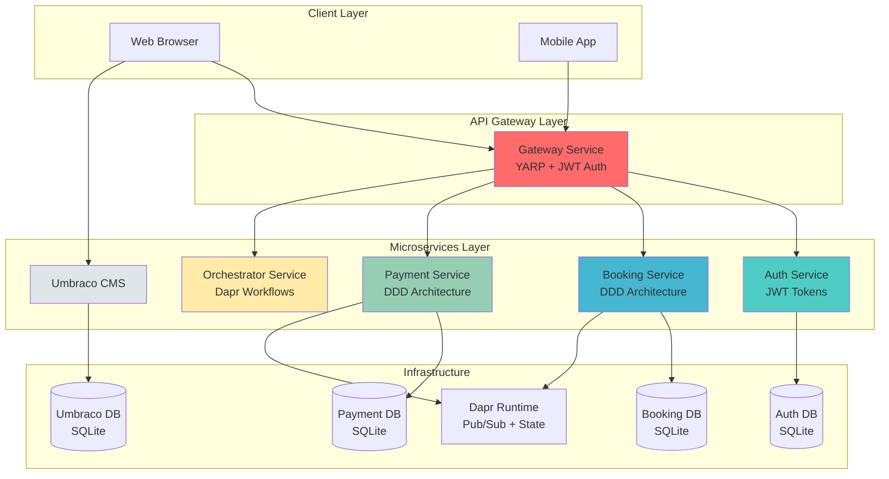
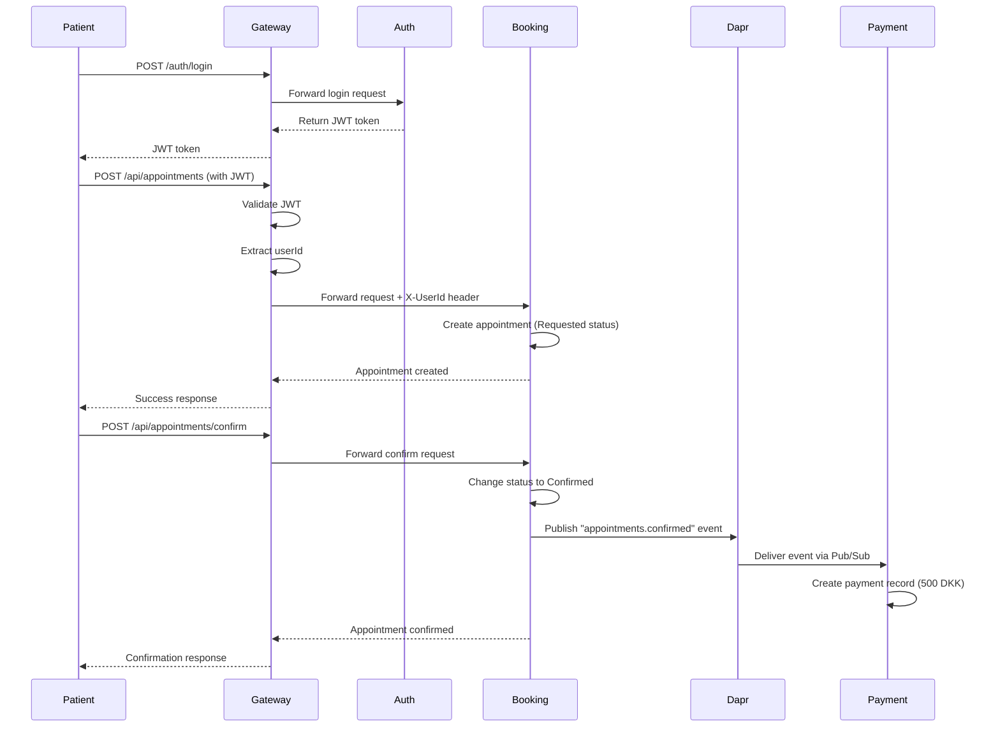
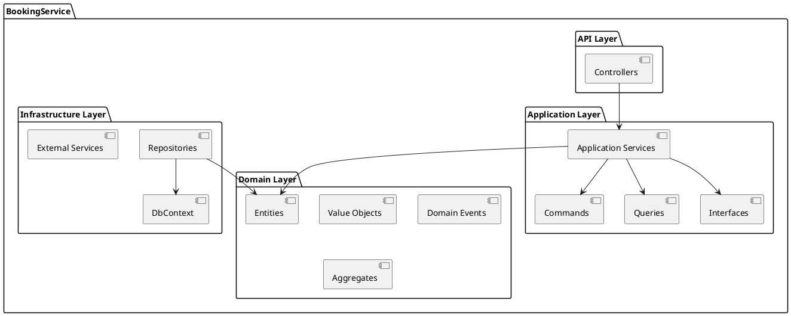
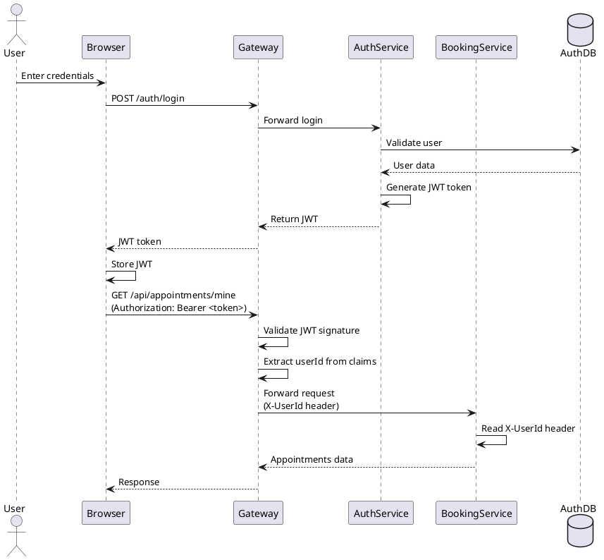
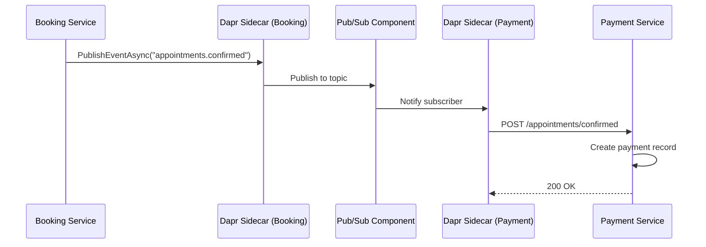

# Architecture Diagrams Source

This file contains text-based architecture diagrams that can be rendered using various tools.

## System Architecture (Mermaid)

## Booking Flow Sequence (Mermaid)

## DDD Structure (PlantUML)

## JWT Authentication Flow (PlantUML)

## Dapr Pub/Sub Flow (Mermaid)

## Service Communication Matrix

| Service | Auth | Booking | Payment | Orchestrator | CMS |
|---------|------|---------|---------|--------------|-----|
| **Gateway** | ✅ HTTP | ✅ HTTP | ✅ HTTP | ✅ HTTP | ❌ |
| **Auth** | - | ❌ | ❌ | ❌ | ❌ |
| **Booking** | ❌ | - | 📤 Pub/Sub | ❌ | ❌ |
| **Payment** | ❌ | 📥 Pub/Sub | - | ❌ | ❌ |
| **Orchestrator** | ❌ | ✅ Dapr | ✅ Dapr | - | ❌ |
| **CMS** | ✅ HTTP | ✅ HTTP | ❌ | ❌ | - |

Legend:
- ✅ Direct HTTP communication
- 📤 Publishes events
- 📥 Subscribes to events
- ❌ No direct communication

## How to Render These Diagrams

### Mermaid Diagrams
1. **GitHub**: Mermaid is natively supported in GitHub markdown
2. **VS Code**: Install "Markdown Preview Mermaid Support" extension
3. **Online**: [Mermaid Live Editor](https://mermaid.live/)

### PlantUML Diagrams
1. **VS Code**: Install "PlantUML" extension
2. **Online**: [PlantUML Web Server](http://www.plantuml.com/plantuml/)
3. **Export**: Generate PNG/SVG and place in appropriate folders

## Tips for Creating Diagrams

1. Keep diagrams simple and focused
2. Use consistent colors and styles
3. Add legends when needed
4. Export at high resolution (300 DPI for print)
5. Save source files (.mmd, .puml) for future edits
